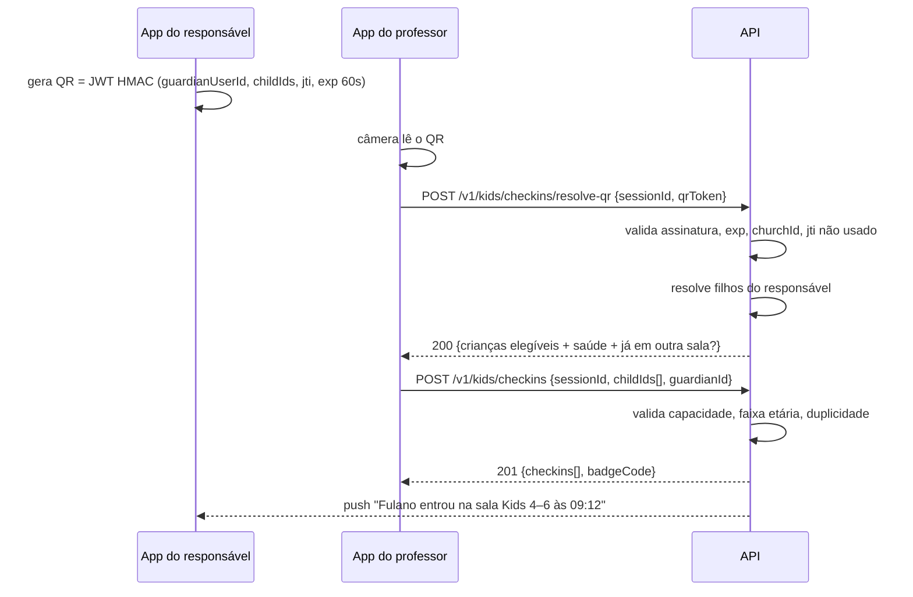
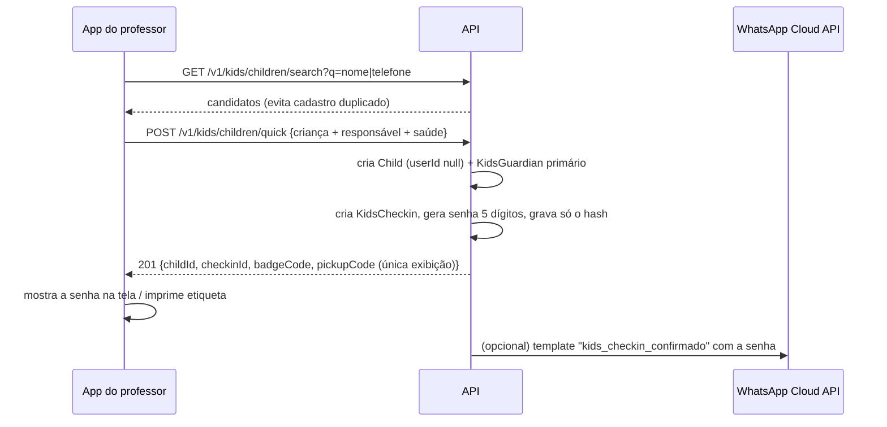
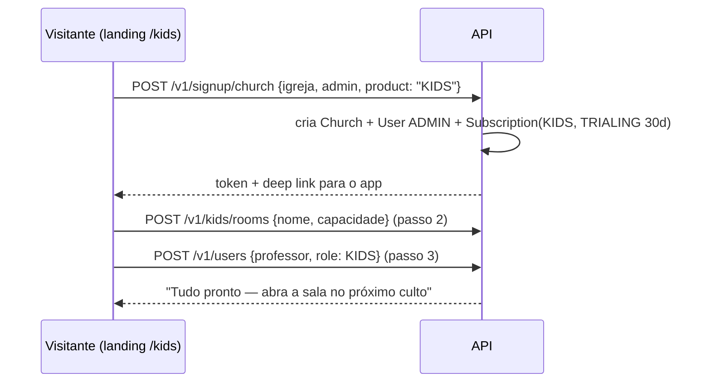

# Kids — Produto de gestão de entrega de crianças nas salinhas

**Status:** proposta técnica (nada implementado ainda) · **Data:** 2026-08-25 · **Branch alvo:** a definir

Produto para controlar a entrega (check-in), o acompanhamento e a devolução
(check-out) de crianças nas salas de aula durante o culto, com registro de
anotações e um canal de alerta escalonado para os responsáveis.

> **Duas formas de venda, um só código.** O Kids é vendido **sozinho** (igreja
> que só quer resolver a salinha) **ou** como parte da suíte Sistema Igreja
> (células, visitantes, presença, materiais). Mesmo deploy, mesmo binário do
> app, mesma base de dados multi-tenant — o que muda é **qual produto a igreja
> assinou**. Nada de fork, nada de segunda instalação.

> **Princípio herdado do SaaS:** o Kids é **aditivo**. Nenhum fluxo atual da
> suíte pode mudar de comportamento por causa dele. Todo dado novo é isolado por
> `churchId`, como o restante.

---

## Sumário

1. [Escopo e glossário](#1-escopo-e-glossário)
2. [Empacotamento: produto avulso ou suíte](#2-empacotamento-produto-avulso-ou-suíte)
3. [Restrições técnicas que mudam o desenho](#3-restrições-técnicas-que-mudam-o-desenho)
4. [Papéis e permissões](#4-papéis-e-permissões)
5. [Modelo de dados (Prisma)](#5-modelo-de-dados-prisma)
6. [Máquinas de estado](#6-máquinas-de-estado)
7. [Fluxos](#7-fluxos)
8. [API REST](#8-api-rest)
9. [Alertas e notificações](#9-alertas-e-notificações)
10. [Segurança](#10-segurança)
11. [LGPD e dados de saúde](#11-lgpd-e-dados-de-saúde)
12. [App Flutter](#12-app-flutter)
13. [Licenciamento, planos e billing](#13-licenciamento-planos-e-billing)
14. [Go-to-market e onboarding](#14-go-to-market-e-onboarding)
15. [Impacto no código existente](#15-impacto-no-código-existente)
16. [Fases de entrega](#16-fases-de-entrega)
17. [Testes e critérios de aceite](#17-testes-e-critérios-de-aceite)
18. [Observabilidade e operação](#18-observabilidade-e-operação)
19. [Riscos e decisões pendentes](#19-riscos-e-decisões-pendentes)

---

## 1. Escopo e glossário

### 1.1 O que o produto faz

| Capacidade | Descrição |
|---|---|
| Cadastro de salas | Nome, capacidade, faixa etária, professores vinculados |
| Cadastro de crianças | Via app do responsável **ou** cadastro rápido feito pelo professor |
| Check-in | Leitura do QR Code do app do responsável **ou** cadastro rápido + senha de 5 dígitos |
| Ocupação em tempo real | Quantas crianças há na sala vs. capacidade |
| Anotações | Individuais (por criança) e gerais (por aula) |
| Alertas | 3 níveis, com push, WhatsApp, ligação e alerta crítico |
| Check-out | QR Code do responsável **ou** senha de 5 dígitos |
| Histórico e relatórios | Quem entregou, quem retirou, quando, por qual método; frequência infantil |

### 1.2 O que **não** faz (fora de escopo v1)

- Controle financeiro/mensalidade de escola infantil.
- Currículo/plano de aula (materiais são da suíte; ver §2.4 para o caso avulso).
- Reconhecimento facial ou biometria.
- Impressão de etiquetas térmicas (avaliado na §19 como item futuro).

### 1.3 Glossário

| Termo | Significado |
|---|---|
| **Produto** (`Product`) | Unidade vendável: `SUITE` ou `KIDS`. Uma igreja assina 1..N |
| **Sala** (`KidsRoom`) | Espaço físico com capacidade e professores. Ex.: "Berçário", "Kids 4–6" |
| **Sessão** (`KidsSession`) | Uma aula: sala + data/culto. É o que abre e fecha |
| **Responsável** (`KidsGuardian`) | Quem entrega/retira. Pode ou não ter conta no app |
| **Check-in** (`KidsCheckin`) | Registro de uma criança dentro de uma sessão |
| **Senha de retirada** | Código de 5 dígitos gerado no check-in de quem não tem app |
| **Alerta** (`KidsAlert`) | Comunicação disparada da sala para o responsável |
| **MAC** | *Monthly Active Children* — crianças distintas com check-in no mês. Métrica de cobrança |

---

## 2. Empacotamento: produto avulso ou suíte

### 2.1 A regra que sustenta tudo

**O Kids não pode depender de nenhuma tabela ou tela da suíte.** Se um endpoint
do Kids precisar de `Cell`, `Visitor`, `CellMember` ou `Attendance`, o produto
avulso quebra. O desenho de dados da §5 respeita isso: as únicas dependências
externas do Kids são **`Church`** e **`User`**, que pertencem ao núcleo.

A recíproca também vale: a suíte funciona sem o Kids exatamente como hoje.

### 2.2 As três camadas

```
┌─────────────────────────────────────────────────────────────┐
│  NÚCLEO (sempre presente, não é vendido separado)           │
│  Church · User · Auth/JWT · Plan/Subscription · Billing     │
│  Notification · DeviceToken · MinIO · tenant-guard          │
└─────────────────────────────────────────────────────────────┘
        ▲                                    ▲
        │                                    │
┌───────────────────────────┐   ┌────────────────────────────┐
│  PRODUTO: SUITE           │   │  PRODUTO: KIDS             │
│  Cells · CellTypes        │   │  KidsRoom · KidsSession    │
│  Visitors · CellMembers   │   │  Child · KidsGuardian      │
│  Attendance · Meetings    │   │  KidsCheckin · KidsNote    │
│  SpiritualHistory         │   │  KidsAlert + deliveries    │
│  Materials · Coordenacao  │   │  Relatórios do ministério  │
│  Dashboard/Relatórios     │   │                            │
└───────────────────────────┘   └────────────────────────────┘
```

Uma igreja pode ter: só `SUITE` (situação atual de todos os clientes), só
`KIDS`, ou os dois.

### 2.3 O que muda em cada modo de venda

| Aspecto | Kids avulso | Kids + Suíte |
|---|---|---|
| Home do ADMIN no app | Painel Kids (salas, sessões abertas, alertas) | Dashboard da suíte, com Kids no menu |
| Menu | Salas · Crianças · Sessões · Relatórios · Configurações | Menu atual + item "Kids" |
| Papéis usados | `ADMIN`, `KIDS`, `RESPONSAVEL` | Todos, incluindo `LIDER`, `SUPERVISOR`, `COORDENADOR` |
| Cadastro de pessoas | Professores (usuários) + crianças + responsáveis | Idem, e a criança pode ser ligada a um membro/visitante já existente |
| Landing/checkout | Página e preço próprios do Kids | Página da suíte, Kids como add-on |
| Onboarding | Signup Kids-only: igreja + admin + 1ª sala em 3 passos | Ativação do add-on dentro do painel |
| Notificações | Só as do Kids | Kids + avisos da suíte, no mesmo inbox |
| Dados compartilhados | — | Criança pode referenciar `CellMember`/`Visitor` (campo opcional, §5.5) |

### 2.4 Ponte opcional com a suíte (só quando os dois estão ativos)

Quando a igreja tem os dois produtos, aparecem integrações que **não existem** no
avulso — e é justamente isso que justifica o bundle:

| Integração | Efeito |
|---|---|
| Criança ↔ família da célula | `Child.cellMemberId` liga a criança ao membro; o líder da célula vê "3 filhos, frequentam Kids 4–6" |
| Visitante ↔ criança | Criança de visitante entra no funil de acompanhamento: primeira visita da família fica registrada |
| Frequência combinada | Relatório "família presente no culto e criança na salinha" |
| Materiais | Sala Kids consome material da biblioteca da suíte |
| WhatsApp | Campanhas da suíte alcançam responsáveis cadastrados no Kids |

**Regra de degradação:** se a igreja cancelar a suíte e ficar só com Kids, esses
campos continuam no banco, mas as telas e endpoints da ponte somem. Nada de erro,
nada de dado perdido — a ponte é sempre `productId`-condicional.

### 2.5 Um app, dois rostos

Um único binário Flutter atende os dois modos. O shell (home, menu, rotas) é
decidido em runtime por **produtos ativos × papel do usuário**:

```dart
// pseudo — lib/core/product/product_context.dart
final products = churchContext.products;      // {'kids'} | {'suite'} | {'suite','kids'}

String initialRoute(UserRole role) => switch (role) {
  UserRole.responsavel                     => '/meus-filhos',
  UserRole.kids                            => '/kids',
  _ when products == {ProductCode.kids}    => '/kids',          // igreja Kids-only
  _                                        => '/dashboard',     // suíte
};
```

**Se o marketing exigir um app com nome/ícone próprios na loja** ("Igreja Kids"),
usar **flavors do Flutter** sobre a mesma base: `--dart-define=PRODUCT=kids` muda
nome, ícone, splash e a rota inicial padrão, sem duplicar código. Custo extra:
duas fichas de loja e dois pipelines de build. Recomendação: começar com **app
único** e só criar o flavor quando houver demanda comercial concreta — ver §19.2.

### 2.6 Caminho de upgrade (o mais importante comercialmente)

Igreja que entra pelo Kids e depois compra a suíte **não migra nada**: é o mesmo
tenant, mesma base, mesmos usuários. Basta uma `Subscription` nova do produto
`SUITE`. Os menus aparecem, os dados do Kids continuam intactos, e a ponte da
§2.4 passa a valer.

Isso torna o Kids um **produto de entrada** legítimo: preço baixo, dor aguda,
implantação de um domingo — e um caminho natural para a suíte completa.

---

## 3. Restrições técnicas que mudam o desenho

Três pontos precisam ser decididos antes do código, porque o pedido original
assume infraestrutura que **hoje não existe** no projeto.

### 3.1 Push notification não está implementado

`firebase_messaging` e `firebase_core` estão no `pubspec.yaml`, mas **nenhuma
linha de Dart usa `FirebaseMessaging`**, e a API **não tem `firebase-admin`**.
As "notificações" atuais (`model Notification`) são in-app: gravadas no banco e
lidas na tela `/notifications`.

**Consequência:** "o pai recebe uma notificação" exige construir a stack de push
do zero — é a Fase 0 (§16). Sem ela, o Nível 1 de alerta vira apenas item na
tela de notificações, o que não serve para uma sala de aula.

Como push é **núcleo** (§2.2), o investimento serve aos dois produtos.

### 3.2 WhatsApp hoje é link, não API

O envio atual (`admin_whatsapp_page.dart:922`) monta `https://wa.me/<fone>?text=…`
e abre o WhatsApp **do próprio usuário** via `url_launcher`. É um envio manual,
com uma pessoa apertando "enviar" — inaceitável para alerta automático.

**Consequência:** alerta por WhatsApp exige **WhatsApp Cloud API** (Meta) ou um
BSP, com **template de utilidade pré-aprovado**, porque a janela de 24 h de
conversa não estará aberta. Ver §9.3.

### 3.3 "Alerta de sinistro tipo Defesa Civil" não é possível para um app

O alerta da Defesa Civil usa **Cell Broadcast / WEA**, um canal da operadora
reservado por lei a autoridades públicas. **Nenhum app de terceiro consegue
emitir esse alerta** — nem com permissão do usuário, nem pagando à operadora.

O que dá para fazer, e que é o mais próximo disso em termos de "furar" o
silencioso do celular:

| Plataforma | Recurso | Requisito |
|---|---|---|
| Android | Canal `IMPORTANCE_HIGH` + `fullScreenIntent` + `CATEGORY_CALL` + som contínuo; tela cheia mesmo bloqueado | Permissão `USE_FULL_SCREEN_INTENT` (Android 14+ pede aprovação na Play Store para apps não-telefonia) |
| Android | Bypass do Não Perturbe | Usuário concede `ACCESS_NOTIFICATION_POLICY` uma vez, no onboarding |
| iOS | **Critical Alerts** — toca mesmo no silencioso/foco | **Entitlement especial aprovado pela Apple** caso a caso; aprovação não é garantida |
| iOS (fallback) | `interruptionLevel: .timeSensitive` | Sem entitlement especial; fura o Foco, não o silencioso |
| Ambos | Push VoIP + CallKit/ConnectionService: o alerta **toca como uma ligação** | Certificado VoIP (iOS); uso fora de VoIP real pode ser rejeitado pela Apple |
| Ambos | Ligação telefônica de verdade (`tel:` no app do professor) | Nenhum — já temos `url_launcher` |

**Recomendação:** Nível 3 = **ligação telefônica imediata** (ação humana,
confiável) **+** push crítico (full-screen no Android, time-sensitive no iOS)
**+** WhatsApp, os três em paralelo. Pedir o entitlement de Critical Alerts à
Apple em paralelo ao desenvolvimento, tratando a aprovação como incerta.
Documentar isso ao cliente para não vender o que a plataforma não entrega —
inclusive no material comercial do produto avulso.

---

## 4. Papéis e permissões

### 4.1 Papéis novos

Dois papéis entram no `enum UserRole` (Prisma + `user_entity.dart`):

- **`KIDS`** — professor/tio da salinha. Opera check-in, check-out, anotações e
  alertas **apenas das salas em que está vinculado**.
- **`RESPONSAVEL`** — pai/mãe/responsável. Conta de escopo mínimo: vê os
  próprios filhos, gera o QR Code, recebe alertas, lê anotações liberadas.

`ADMIN` administra salas e vê tudo do produto. Em igreja **Kids-only**, `ADMIN` é
o pastor/coordenador do ministério infantil e nunca vê tela de célula — porque
não existe assinatura da suíte.

### 4.2 Matriz

| Ação | RESPONSAVEL | KIDS | ADMIN | SUPERADMIN |
|---|:--:|:--:|:--:|:--:|
| Cadastrar/editar sala | — | — | ✔ | ✔ |
| Vincular professor à sala | — | — | ✔ | ✔ |
| Abrir/fechar sessão | — | ✔ (sua sala) | ✔ | ✔ |
| Check-in / check-out | — | ✔ (sua sala) | ✔ | ✔ |
| Cadastro rápido de criança | — | ✔ | ✔ | ✔ |
| Anotação individual | ler¹ | ✔ | ✔ | ✔ |
| Anotação geral da aula | ler | ✔ | ✔ | ✔ |
| Alerta nível 1 e 2 | receber | ✔ | ✔ | ✔ |
| Alerta nível 3 (emergência) | receber | ✔ | ✔ | ✔ |
| Ver dados de saúde da criança | ✔ (filho) | ✔ (em sala) | ✔ | ✔ |
| Gerar QR do responsável | ✔ | — | — | — |
| Relatórios do ministério | — | — | ✔ | ✔ |
| Assinar/trocar produto | — | — | ✔ | ✔ |

¹ Anotação individual tem campo `visibleToGuardian` — o professor decide se a
observação vai para o responsável ou fica como registro interno.

**Regra de ouro do `KIDS`:** todo endpoint valida que o professor está em
`KidsRoomTeacher` da sala da sessão. Não basta o papel.

---

## 5. Modelo de dados (Prisma)

### 5.1 Núcleo: produto e assinatura multi-produto

Hoje `Subscription` é 1:1 com `Church` (`churchId @unique`) e aponta para um
único `Plan`. Para vender dois produtos, a assinatura passa a ser **por produto**.

```prisma
enum ProductCode { SUITE KIDS }

model Product {
  id          String      @id @default(uuid())
  code        ProductCode @unique
  name        String                              // "Sistema Igreja" | "Kids"
  description String?
  isActive    Boolean     @default(true) @map("is_active")

  plans         Plan[]
  subscriptions Subscription[]

  @@map("products")
}

model Plan {
  id          String   @id @default(uuid())
  productId   String   @map("product_id")         // ← novo
  tier        PlanTier
  name        String
  description String?
  priceMonth  Int      @default(0) @map("price_month")
  priceYear   Int      @default(0) @map("price_year")
  features    String[] @default([])
  limits      Json     @default("{}")             // ← novo: { rooms: 3, mac: 150, whatsapp: 200 }
  isActive    Boolean  @default(true) @map("is_active")
  createdAt   DateTime @default(now()) @map("created_at")
  updatedAt   DateTime @updatedAt @map("updated_at")

  product       Product        @relation(fields: [productId], references: [id])
  subscriptions Subscription[]

  @@unique([productId, tier])                     // era @@unique([tier])
  @@map("plans")
}

model Subscription {
  id                     String             @id @default(uuid())
  churchId               String             @map("church_id")   // ← perde o @unique
  productId              String             @map("product_id")  // ← novo
  planId                 String             @map("plan_id")
  status                 SubscriptionStatus @default(TRIALING)
  billingCycle           BillingCycle       @default(MONTHLY) @map("billing_cycle")
  provider               String             @default("manual")
  externalCustomerId     String?            @map("external_customer_id")
  externalSubscriptionId String?            @map("external_subscription_id")
  trialEndsAt            DateTime?          @map("trial_ends_at")
  currentPeriodEnd       DateTime?          @map("current_period_end")
  createdAt              DateTime           @default(now()) @map("created_at")
  updatedAt              DateTime           @updatedAt @map("updated_at")

  church  Church  @relation(fields: [churchId], references: [id], onDelete: Cascade)
  product Product @relation(fields: [productId], references: [id])
  plan    Plan    @relation(fields: [planId], references: [id])

  @@unique([churchId, productId])                 // uma assinatura por produto
  @@index([planId])
  @@map("subscriptions")
}
```

**Migração dos clientes atuais (crítica, não pode falhar):**

```sql
-- 1. cria os produtos
INSERT INTO products (id, code, name) VALUES
  (gen_random_uuid(), 'SUITE', 'Sistema Igreja'),
  (gen_random_uuid(), 'KIDS',  'Kids');

-- 2. todo plano existente pertence à SUITE
ALTER TABLE plans ADD COLUMN product_id TEXT;
UPDATE plans SET product_id = (SELECT id FROM products WHERE code = 'SUITE');
ALTER TABLE plans ALTER COLUMN product_id SET NOT NULL;

-- 3. toda assinatura existente é da SUITE
ALTER TABLE subscriptions ADD COLUMN product_id TEXT;
UPDATE subscriptions SET product_id = (SELECT id FROM products WHERE code = 'SUITE');
ALTER TABLE subscriptions ALTER COLUMN product_id SET NOT NULL;
DROP INDEX subscriptions_church_id_key;                 -- remove o @unique antigo
CREATE UNIQUE INDEX subscriptions_church_id_product_id_key
  ON subscriptions (church_id, product_id);
```

Nenhum cliente atual percebe a mudança: continua com uma assinatura, agora
explicitamente da SUITE.

### 5.2 Enums do Kids

```prisma
enum KidsSessionStatus { OPEN CLOSED }
enum KidsCheckinStatus { CHECKED_IN CHECKED_OUT NO_SHOW }
enum KidsCheckMethod   { QR CODE MANUAL }          // MANUAL = liberação com justificativa
enum KidsNoteKind      { INDIVIDUAL CLASS }
enum KidsAlertLevel    { INFO URGENT EMERGENCY }   // níveis 1, 2 e 3
enum KidsAlertStatus   { OPEN ACKNOWLEDGED RESOLVED }
enum KidsChannel       { PUSH WHATSAPP SMS CALL CRITICAL_PUSH }
enum KidsDeliveryStatus{ QUEUED SENT DELIVERED READ FAILED }
enum KidsTeacherRole   { TITULAR AUXILIAR }
enum GuardianRelation  { PAI MAE AVO TIO RESPONSAVEL_LEGAL OUTRO }
```

### 5.3 Sala e professores

```prisma
model KidsRoom {
  id           String   @id @default(uuid())
  churchId     String?  @map("church_id")
  name         String
  description  String?
  capacity     Int
  minAgeMonths Int?     @map("min_age_months")   // faixa etária em meses: berçário precisa
  maxAgeMonths Int?     @map("max_age_months")
  color        String   @default("#3F51B5")
  isActive     Boolean  @default(true) @map("is_active")
  createdAt    DateTime @default(now()) @map("created_at")
  updatedAt    DateTime @updatedAt @map("updated_at")

  church   Church?           @relation(fields: [churchId], references: [id])
  teachers KidsRoomTeacher[]
  sessions KidsSession[]

  @@index([churchId])
  @@map("kids_rooms")
}

model KidsRoomTeacher {
  id        String          @id @default(uuid())
  churchId  String?         @map("church_id")
  roomId    String          @map("room_id")
  userId    String          @map("user_id")
  role      KidsTeacherRole @default(AUXILIAR)
  createdAt DateTime        @default(now()) @map("created_at")

  church Church?  @relation(fields: [churchId], references: [id])
  room   KidsRoom @relation(fields: [roomId], references: [id], onDelete: Cascade)
  user   User     @relation("KidsTeacher", fields: [userId], references: [id], onDelete: Cascade)

  @@unique([roomId, userId])
  @@index([churchId])
  @@index([userId])
  @@map("kids_room_teachers")
}
```

### 5.4 Sessão (a aula)

```prisma
model KidsSession {
  id               String            @id @default(uuid())
  churchId         String?           @map("church_id")
  roomId           String            @map("room_id")
  serviceDate      DateTime          @map("service_date") @db.Date
  serviceName      String?           @map("service_name")   // "Culto da manhã"
  status           KidsSessionStatus @default(OPEN)
  openedById       String            @map("opened_by_id")
  openedAt         DateTime          @default(now()) @map("opened_at")
  closedById       String?           @map("closed_by_id")
  closedAt         DateTime?         @map("closed_at")
  lesson           String?
  capacityOverride Int?              @map("capacity_override")

  church   Church?       @relation(fields: [churchId], references: [id])
  room     KidsRoom      @relation(fields: [roomId], references: [id])
  openedBy User          @relation("KidsSessionOpened", fields: [openedById], references: [id])
  checkins KidsCheckin[]
  notes    KidsNote[]
  alerts   KidsAlert[]

  @@unique([roomId, serviceDate, serviceName])
  @@index([churchId])
  @@index([roomId, serviceDate])
  @@map("kids_sessions")
}
```

> `@@unique([roomId, serviceDate, serviceName])` impede duas sessões
> concorrentes da mesma sala no mesmo culto — erro comum quando dois professores
> abrem a sala ao mesmo tempo.

### 5.5 Criança e responsáveis

O `model Child` **já existe** (filhos cadastrados no perfil do usuário: `userId`,
`name`, `birthDate`). O produto o estende — `userId` passa a ser **opcional**,
porque criança cadastrada no balcão não tem responsável com conta.

```prisma
model Child {
  id               String    @id @default(uuid())
  churchId         String?   @map("church_id")
  userId           String?   @map("user_id")            // ← passa a ser nullable
  cellMemberId     String?   @map("cell_member_id")     // ← ponte opcional com a SUITE (§2.4)
  visitorId        String?   @map("visitor_id")         // ← idem; null em igreja Kids-only
  name             String
  birthDate        DateTime? @map("birth_date")
  gender           Gender?
  photoKey         String?   @map("photo_key")          // MinIO; opcional, ver §11
  allergies        String?   @db.Text                   // dado sensível
  medications      String?   @db.Text                   // dado sensível
  disabilities     String?   @db.Text                   // dado sensível
  medicalNotes     String?   @db.Text                   // dado sensível
  authorizedPickup String?   @db.Text                   // quem mais pode retirar
  isActive         Boolean   @default(true) @map("is_active")
  createdAt        DateTime  @default(now()) @map("created_at")
  updatedAt        DateTime  @updatedAt @map("updated_at")

  church     Church?        @relation(fields: [churchId], references: [id])
  user       User?          @relation(fields: [userId], references: [id], onDelete: SetNull)
  cellMember CellMember?    @relation(fields: [cellMemberId], references: [id], onDelete: SetNull)
  visitor    Visitor?       @relation(fields: [visitorId], references: [id], onDelete: SetNull)
  guardians  KidsGuardian[]
  checkins   KidsCheckin[]
  notes      KidsNote[]
  alerts     KidsAlert[]

  @@index([churchId])
  @@index([userId])
  @@map("children")
}
```

> **Atenção ao avulso:** `cellMemberId` e `visitorId` são **nullable e nunca
> obrigatórios**. Nenhuma query do Kids pode fazer `JOIN` obrigatório com eles —
> só a ponte da §2.4 os usa, e só quando `SUITE` está ativo. É a única concessão
> de acoplamento, e ela é opcional em tempo de execução.

```prisma
model KidsGuardian {
  id          String           @id @default(uuid())
  churchId    String?          @map("church_id")
  childId     String           @map("child_id")
  userId      String?          @map("user_id")     // preenchido se tiver conta no app
  name        String
  phone       String                               // E.164: +5511999999999
  hasWhatsapp Boolean          @default(true) @map("has_whatsapp")
  relation    GuardianRelation @default(RESPONSAVEL_LEGAL)
  isPrimary   Boolean          @default(false) @map("is_primary")
  canPickup   Boolean          @default(true) @map("can_pickup")
  createdAt   DateTime         @default(now()) @map("created_at")

  church Church? @relation(fields: [churchId], references: [id])
  child  Child   @relation(fields: [childId], references: [id], onDelete: Cascade)
  user   User?   @relation("KidsGuardian", fields: [userId], references: [id], onDelete: SetNull)

  @@index([churchId])
  @@index([childId])
  @@index([userId])
  @@map("kids_guardians")
}
```

### 5.6 Check-in / check-out

```prisma
model KidsCheckin {
  id        String            @id @default(uuid())
  churchId  String?           @map("church_id")
  sessionId String            @map("session_id")
  childId   String            @map("child_id")
  status    KidsCheckinStatus @default(CHECKED_IN)
  badgeCode String            @map("badge_code")    // sequencial legível da sessão: "K-014"

  checkinAt         DateTime        @default(now()) @map("checkin_at")
  checkinById       String          @map("checkin_by_id")
  checkinMethod     KidsCheckMethod @map("checkin_method")
  checkinGuardianId String?         @map("checkin_guardian_id")

  // Senha de retirada — apenas para quem não usa QR. Nunca em texto puro.
  pickupCodeHash    String?   @map("pickup_code_hash")
  pickupCodeLast2   String?   @map("pickup_code_last2")  // conferência visual no balcão
  pickupAttempts    Int       @default(0) @map("pickup_attempts")
  pickupLockedUntil DateTime? @map("pickup_locked_until")

  checkoutAt           DateTime?        @map("checkout_at")
  checkoutById         String?          @map("checkout_by_id")
  checkoutMethod       KidsCheckMethod? @map("checkout_method")
  checkoutGuardianId   String?          @map("checkout_guardian_id")
  checkoutGuardianName String?          @map("checkout_guardian_name") // liberação MANUAL
  checkoutReason       String?          @map("checkout_reason")        // justificativa da MANUAL

  church  Church?     @relation(fields: [churchId], references: [id])
  session KidsSession @relation(fields: [sessionId], references: [id], onDelete: Cascade)
  child   Child       @relation(fields: [childId], references: [id])
  notes   KidsNote[]
  alerts  KidsAlert[]

  @@unique([sessionId, childId])       // a mesma criança não entra duas vezes
  @@unique([sessionId, badgeCode])
  @@index([churchId])
  @@index([status])
  @@index([churchId, checkinAt])       // base do cálculo de MAC (§13.4)
  @@map("kids_checkins")
}
```

### 5.7 Anotações

```prisma
model KidsNote {
  id                String       @id @default(uuid())
  churchId          String?      @map("church_id")
  sessionId         String       @map("session_id")
  kind              KidsNoteKind
  childId           String?      @map("child_id")     // null quando kind = CLASS
  checkinId         String?      @map("checkin_id")
  body              String       @db.Text
  visibleToGuardian Boolean      @default(true) @map("visible_to_guardian")
  authorId          String       @map("author_id")
  createdAt         DateTime     @default(now()) @map("created_at")
  updatedAt         DateTime     @updatedAt @map("updated_at")

  church  Church?      @relation(fields: [churchId], references: [id])
  session KidsSession  @relation(fields: [sessionId], references: [id], onDelete: Cascade)
  child   Child?       @relation(fields: [childId], references: [id])
  checkin KidsCheckin? @relation(fields: [checkinId], references: [id])
  author  User         @relation("KidsNoteAuthor", fields: [authorId], references: [id])

  @@index([churchId])
  @@index([sessionId, kind])
  @@index([childId])
  @@map("kids_notes")
}
```

### 5.8 Alertas e entregas

```prisma
model KidsAlert {
  id                       String          @id @default(uuid())
  churchId                 String?         @map("church_id")
  sessionId                String          @map("session_id")
  childId                  String          @map("child_id")
  checkinId                String?         @map("checkin_id")
  level                    KidsAlertLevel
  status                   KidsAlertStatus @default(OPEN)
  message                  String          @db.Text
  createdById              String          @map("created_by_id")
  createdAt                DateTime        @default(now()) @map("created_at")
  acknowledgedAt           DateTime?       @map("acknowledged_at")
  acknowledgedByGuardianId String?         @map("acknowledged_by_guardian_id")
  resolvedAt               DateTime?       @map("resolved_at")
  resolvedById             String?         @map("resolved_by_id")

  church     Church?             @relation(fields: [churchId], references: [id])
  session    KidsSession         @relation(fields: [sessionId], references: [id], onDelete: Cascade)
  child      Child               @relation(fields: [childId], references: [id])
  checkin    KidsCheckin?        @relation(fields: [checkinId], references: [id])
  deliveries KidsAlertDelivery[]

  @@index([churchId])
  @@index([sessionId, status])
  @@map("kids_alerts")
}

model KidsAlertDelivery {
  id                String             @id @default(uuid())
  churchId          String?            @map("church_id")
  alertId           String             @map("alert_id")
  guardianId        String?            @map("guardian_id")
  userId            String?            @map("user_id")
  channel           KidsChannel
  status            KidsDeliveryStatus @default(QUEUED)
  providerMessageId String?            @map("provider_message_id")
  error             String?            @db.Text
  attempts          Int                @default(0)
  queuedAt          DateTime           @default(now()) @map("queued_at")
  sentAt            DateTime?          @map("sent_at")
  deliveredAt       DateTime?          @map("delivered_at")
  readAt            DateTime?          @map("read_at")

  church   Church?       @relation(fields: [churchId], references: [id])
  alert    KidsAlert     @relation(fields: [alertId], references: [id], onDelete: Cascade)
  guardian KidsGuardian? @relation(fields: [guardianId], references: [id])

  @@index([churchId])
  @@index([alertId])
  @@index([status])
  @@index([churchId, channel, queuedAt])   // base do contador de WhatsApp do mês
  @@map("kids_alert_deliveries")
}
```

### 5.9 Infra de push e antifraude do QR (núcleo)

```prisma
model DeviceToken {
  id            String   @id @default(uuid())
  churchId      String?  @map("church_id")
  userId        String   @map("user_id")
  token         String   @unique
  platform      String                                  // android | ios | web
  appVersion    String?  @map("app_version")
  criticalOptIn Boolean  @default(false) @map("critical_opt_in")
  lastSeenAt    DateTime @default(now()) @map("last_seen_at")
  createdAt     DateTime @default(now()) @map("created_at")

  church Church? @relation(fields: [churchId], references: [id])
  user   User    @relation("UserDevices", fields: [userId], references: [id], onDelete: Cascade)

  @@index([churchId])
  @@index([userId])
  @@map("device_tokens")
}

/// Nonce do QR do responsável — impede que um print do QR seja reusado.
model KidsQrNonce {
  jti       String   @id
  userId    String   @map("user_id")
  usedAt    DateTime @default(now()) @map("used_at")
  expiresAt DateTime @map("expires_at")

  @@index([expiresAt])
  @@map("kids_qr_nonces")
}
```

### 5.10 Migrações

```
0003_products              ← precede tudo; roda sozinha e é reversível
  - CreateEnum  ProductCode
  - CreateTable products
  - AlterTable  plans        ADD product_id (+ backfill SUITE), limits jsonb
  - AlterTable  subscriptions ADD product_id (+ backfill SUITE), trial_ends_at
  - DropIndex   subscriptions_church_id_key
  - CreateIndex subscriptions_church_id_product_id_key

0004_kids_enums            ← isolada: ALTER TYPE não convive com DDL em transação
  - AlterEnum   UserRole: ADD VALUE 'KIDS', ADD VALUE 'RESPONSAVEL'
  - CreateEnum  (9 enums do Kids)

0005_kids_module
  - CreateTable kids_rooms, kids_room_teachers, kids_sessions, kids_guardians,
                kids_checkins, kids_notes, kids_alerts, kids_alert_deliveries,
                device_tokens, kids_qr_nonces
  - AlterTable  children:
      ALTER COLUMN user_id DROP NOT NULL
      ADD COLUMN cell_member_id, visitor_id, gender, photo_key, allergies,
                 medications, disabilities, medical_notes, authorized_pickup,
                 is_active, updated_at
```

---

## 6. Máquinas de estado

### 6.1 Sessão

```
        abrir sala                 fechar sala
  (—) ─────────────▶ OPEN ─────────────────────▶ CLOSED
                      │
                      └── só aceita check-in enquanto OPEN
```

Fechar sessão com criança `CHECKED_IN` **é bloqueado** (409). O professor
precisa fazer check-out de todas ou registrar liberação `MANUAL` com
justificativa.

### 6.2 Check-in

```
  CHECKED_IN ──── check-out válido ────▶ CHECKED_OUT
      │
      └── sessão fechada sem retirada ─▶ (bloqueado; exige MANUAL + motivo)

  NO_SHOW: criança pré-agendada que não apareceu (uso futuro, §19)
```

### 6.3 Alerta

```
  OPEN ──── responsável abre/confirma ────▶ ACKNOWLEDGED ──── professor encerra ───▶ RESOLVED
    │                                                                                   ▲
    └──────────────── professor encerra sem confirmação do pai ─────────────────────────┘
```

Alerta `EMERGENCY` **não** é auto-resolvido: exige ação explícita de quem abriu.

### 6.4 Assinatura de produto

```
  TRIALING ──── pagamento ok ────▶ ACTIVE ──── falha de cobrança ────▶ PAST_DUE
     │                               │                                    │
     │ trial expira sem pagar        │ cancelamento                       │ 15 dias
     ▼                               ▼                                    ▼
  CANCELED ◀──────────────────────────────────────────────────────── CANCELED
```

**Degradação em `PAST_DUE`/`CANCELED` do produto Kids:** a igreja perde o acesso
de escrita (não abre sessão nova, não cria sala), mas **mantém leitura do
histórico por 90 dias** e **nunca perde uma sessão em andamento**. Bloquear
check-out de criança por inadimplência seria irresponsável — ver §13.5.

---

## 7. Fluxos

### 7.1 Check-in com QR (responsável tem o app)



Se o responsável tem app, **não há senha de 5 dígitos**: a retirada usa o mesmo
QR. Esse é o caminho seguro e deve ser o incentivado — inclusive no discurso de
venda do produto avulso.

### 7.2 Check-in sem app (cadastro rápido)



**Campos do cadastro rápido** — objetivo, cabe em uma tela:

1. Nome da criança · data de nascimento (ou idade) · sexo
2. Comorbidade / alergia · medicação em uso · deficiência *(um campo de texto cada, todos opcionais)*
3. Responsável: nome · telefone (com "tem WhatsApp?" marcado por padrão) · parentesco
4. Contato de emergência alternativo (opcional)
5. Quem mais pode retirar (texto livre, opcional)

### 7.3 Check-out

```mermaid
sequenceDiagram
  participant T as App do professor
  participant A as API
  alt Responsável com app
    T->>A: POST /v1/kids/checkins/:id/checkout {qrToken}
    A->>A: valida QR + vínculo guardian↔child
  else Sem app
    T->>A: POST /v1/kids/checkins/:id/checkout {pickupCode}
    A->>A: compara hash; erra → attempts++; 5 erros → lock 15 min
  else Liberação manual
    T->>A: POST /v1/kids/checkins/:id/checkout {method: MANUAL, guardianName, reason}
    A->>A: exige papel ADMIN ou TITULAR + motivo obrigatório
  end
  A-->>T: 200 {checkoutAt}
  A-->>P: push "Fulano foi retirado às 10:47 por Maria"
```

### 7.4 Anotações

- **Individual:** vinculada ao `checkinId` (e portanto à sessão e à criança).
  Chave `visibleToGuardian` decide se aparece para o responsável.
- **Geral da aula:** `kind = CLASS`, sem `childId`. Vai para todos os
  responsáveis das crianças presentes naquela sessão, ao fechar a sala.

### 7.5 Alerta escalonado

| Nível | Quando usar | Canais disparados | Confirmação |
|---|---|---|---|
| **1 · INFO** | "Trouxe lanche?", "Precisa de fralda" | Push (se tem app) → WhatsApp se sem app ou sem leitura em 3 min | Opcional |
| **2 · URGENT** | "Está chorando muito", "Passou mal" | Push + WhatsApp em paralelo, **sempre os dois** | Pedida; se não houver em 2 min, tela do professor sugere ligar |
| **3 · EMERGENCY** | Acidente, convulsão, criança sumida | Push crítico + WhatsApp + **discagem automática** na tela do professor + alerta na tela de todos os ADMIN logados | Obrigatória; alerta fica `OPEN` até alguém resolver |

Toda tentativa vira uma linha em `KidsAlertDelivery` — é o rastro de que a igreja
tentou avisar, o que importa juridicamente se algo der errado.

### 7.6 Onboarding Kids avulso (3 passos, self-service)



Meta: **igreja operando no primeiro domingo**, sem implantação assistida. Esse é
o critério que separa um produto vendável sozinho de um módulo de suíte.

---

## 8. API REST

Prefixo `/v1/kids`, atrás de `authMiddleware` + `requireProduct('KIDS')` (§15).
Padrão de erro e envelope seguem o restante da API (`AppError`,
`{ error: { code, message } }`).

### 8.1 Salas

| Método | Rota | Papel | Descrição |
|---|---|---|---|
| `GET` | `/rooms` | KIDS, ADMIN | Lista salas com ocupação da sessão aberta |
| `POST` | `/rooms` | ADMIN | Cria sala (valida limite do plano) |
| `PATCH` | `/rooms/:id` | ADMIN | Edita sala |
| `DELETE` | `/rooms/:id` | ADMIN | Desativa (soft delete via `isActive`) |
| `PUT` | `/rooms/:id/teachers` | ADMIN | Substitui a lista de professores |

### 8.2 Sessões

| Método | Rota | Papel | Descrição |
|---|---|---|---|
| `POST` | `/rooms/:id/sessions` | KIDS, ADMIN | Abre a aula (`serviceDate`, `serviceName`, `lesson`) |
| `GET` | `/sessions/:id` | KIDS, ADMIN | Sessão + lista de check-ins + notas |
| `PATCH` | `/sessions/:id` | KIDS, ADMIN | Edita lição/nome do culto |
| `POST` | `/sessions/:id/close` | KIDS, ADMIN | Fecha; 409 se houver `CHECKED_IN` |
| `GET` | `/sessions` | ADMIN | Histórico com filtros (sala, período) |

### 8.3 Crianças e responsáveis

| Método | Rota | Papel | Descrição |
|---|---|---|---|
| `GET` | `/children/search?q=` | KIDS, ADMIN | Busca por nome da criança ou telefone do responsável |
| `POST` | `/children/quick` | KIDS, ADMIN | Cadastro rápido (§7.2) |
| `GET` | `/children/:id` | KIDS (em sala), ADMIN, RESPONSAVEL (filho) | Ficha completa |
| `PATCH` | `/children/:id` | ADMIN, RESPONSAVEL (filho) | Edita ficha/saúde |
| `POST` | `/children/:id/guardians` | ADMIN, RESPONSAVEL | Adiciona responsável |
| `POST` | `/children/:id/link-user` | ADMIN | Vincula criança do balcão a uma conta criada depois |
| `POST` | `/children/:id/link-member` | ADMIN | **Só com SUITE ativa:** liga a criança a um `CellMember`/`Visitor` (§2.4) |

### 8.4 Check-in / check-out

| Método | Rota | Papel | Descrição |
|---|---|---|---|
| `POST` | `/checkins/resolve-qr` | KIDS | Valida QR e devolve filhos elegíveis |
| `POST` | `/checkins` | KIDS | Confirma check-in de 1..N crianças |
| `POST` | `/checkins/:id/checkout` | KIDS | QR, senha ou liberação manual |
| `GET` | `/checkins/:id` | KIDS, ADMIN | Detalhe + anotações + alertas |
| `POST` | `/checkins/:id/regenerate-code` | KIDS, ADMIN | Nova senha (pai perdeu o papel); invalida a anterior |

**`POST /v1/kids/checkins`** — corpo e resposta:

```jsonc
// request
{
  "sessionId": "uuid",
  "childIds": ["uuid", "uuid"],
  "guardianId": "uuid",          // quem entregou
  "method": "QR",                // QR | CODE | MANUAL
  "qrToken": "eyJhbGciOi..."     // obrigatório quando method = QR
}

// 201
{
  "checkins": [
    {
      "id": "uuid",
      "childId": "uuid",
      "childName": "Ana Beatriz",
      "badgeCode": "K-014",
      "pickupCode": "48213",     // ← só aqui, uma única vez; depois só o hash
      "healthFlags": ["alergia: amendoim", "uso contínuo: ritalina"]
    }
  ],
  "roomOccupancy": { "current": 14, "capacity": 20 }
}
```

Erros específicos: `409 KIDS_ROOM_FULL`, `409 KIDS_ALREADY_CHECKED_IN`,
`422 KIDS_AGE_OUT_OF_RANGE` (com `force: true` para o professor sobrepor),
`401 KIDS_QR_EXPIRED`, `409 KIDS_QR_REPLAY`.

### 8.5 Anotações

| Método | Rota | Papel |
|---|---|---|
| `POST` | `/sessions/:id/notes` | KIDS |
| `PATCH` | `/notes/:id` | KIDS (autor), ADMIN |
| `DELETE` | `/notes/:id` | ADMIN |
| `GET` | `/children/:id/notes` | RESPONSAVEL (filho), KIDS, ADMIN |

### 8.6 Alertas

| Método | Rota | Papel | Descrição |
|---|---|---|---|
| `POST` | `/checkins/:id/alerts` | KIDS | Cria alerta e enfileira entregas |
| `POST` | `/alerts/:id/acknowledge` | RESPONSAVEL | "Estou indo" |
| `POST` | `/alerts/:id/resolve` | KIDS, ADMIN | Encerra |
| `POST` | `/alerts/:id/deliveries/call` | KIDS | Registra que a ligação foi feita |
| `GET` | `/alerts?status=OPEN` | KIDS, ADMIN | Painel de alertas abertos |
| `GET` | `/alerts/:id/deliveries` | ADMIN | Rastro de entrega por canal |

### 8.7 Relatórios (dashboard próprio do produto)

Igreja Kids-only não tem o dashboard da suíte — o produto precisa do seu.

| Método | Rota | Papel | Descrição |
|---|---|---|---|
| `GET` | `/reports/overview?from&to` | ADMIN | Crianças únicas, check-ins, média por culto, ocupação por sala |
| `GET` | `/reports/children/:id` | ADMIN | Histórico da criança: presenças, anotações, alertas |
| `GET` | `/reports/rooms/:id` | ADMIN | Ocupação e alertas da sala no período |
| `GET` | `/reports/export?format=xlsx` | ADMIN | Export operacional (**sem** campos de saúde, §11) |

### 8.8 Dispositivos, QR e assinatura

| Método | Rota | Papel | Descrição |
|---|---|---|---|
| `POST` | `/v1/devices` | qualquer autenticado | Registra/atualiza token FCM |
| `DELETE` | `/v1/devices/:token` | qualquer autenticado | Logout/desinstalação |
| `GET` | `/v1/kids/my-qr` | RESPONSAVEL | Token curto para o QR (TTL 60 s) |
| `GET` | `/v1/kids/my-children` | RESPONSAVEL | Filhos + status atual (em qual sala está agora) |
| `GET` | `/v1/billing/products` | ADMIN | Produtos disponíveis, plano atual, uso vs. limites |
| `POST` | `/v1/billing/subscribe` | ADMIN | Assina produto (`SUITE` ou `KIDS`), com bundle se os dois |

---

## 9. Alertas e notificações

### 9.1 Arquitetura de entrega

```
POST /kids/checkins/:id/alerts
        │
        ├── grava KidsAlert
        ├── resolve destinatários: guardians do child (isPrimary primeiro)
        ├── verifica cota de WhatsApp do plano (§13.5)
        └── para cada destinatário × canal aplicável:
                grava KidsAlertDelivery(QUEUED)
                        │
                        ▼
              AlertDispatcher (fila)
                ├── PUSH          → FcmService           (firebase-admin)
                ├── CRITICAL_PUSH → FcmService           (canal crítico + full-screen)
                ├── WHATSAPP      → WhatsappCloudService (template)
                ├── SMS           → (opcional, §19)
                └── CALL          → não envia nada: marca SENT quando o professor
                                     realmente disca (registro do ato)
```

**Fila:** v1 pode rodar in-process com retry exponencial (3 tentativas: 0 s,
30 s, 2 min), porque o volume é baixo (dezenas por culto). Se virar gargalo,
trocar por BullMQ/Redis sem mudar o contrato — o `AlertDispatcher` é uma
interface no domínio.

### 9.2 Push (FCM)

Novo `IPushService` no domínio; implementação `FcmPushService` com
`firebase-admin`. Payload:

```jsonc
{
  "notification": { "title": "Kids 4–6 · Ana Beatriz", "body": "Está com febre" },
  "data": {
    "type": "kids_alert",
    "level": "URGENT",
    "alertId": "uuid",
    "childId": "uuid",
    "deepLink": "/kids/alerts/uuid"
  },
  "android": {
    "priority": "high",
    "notification": {
      "channelId": "kids_urgent",           // ou kids_emergency
      "sound": "alerta",
      "visibility": "public"
    }
  },
  "apns": {
    "headers": { "apns-priority": "10", "apns-push-type": "alert" },
    "payload": { "aps": {
      "sound": { "critical": 1, "name": "alerta.caf", "volume": 1.0 },  // só com entitlement
      "interruption-level": "critical"                                   // fallback: time-sensitive
    } }
  }
}
```

Canais Android (criados no primeiro boot do app):

| Canal | Importância | Uso |
|---|---|---|
| `kids_info` | DEFAULT | Nível 1 |
| `kids_urgent` | HIGH | Nível 2 |
| `kids_emergency` | HIGH + bypassDnd + fullScreenIntent + som contínuo | Nível 3 |

### 9.3 WhatsApp (Cloud API)

Alerta chega **fora da janela de 24 h**, então só passa com **template
pré-aprovado** (categoria *Utility*). Três templates a submeter:

| Nome | Corpo | Variáveis |
|---|---|---|
| `kids_checkin_confirmado` | "Olá {{1}}! {{2}} foi recebido(a) na sala {{3}} às {{4}}. Senha de retirada: {{5}}. Guarde esta mensagem." | 5 |
| `kids_alerta_urgente` | "Aviso da sala {{1}} sobre {{2}}: {{3}}. Por favor, dirija-se à salinha." | 3 |
| `kids_emergencia` | "EMERGÊNCIA na sala {{1}} sobre {{2}}: {{3}}. Estamos ligando para você agora." | 3 |

Config nova em `.env`: `WHATSAPP_PROVIDER`, `WHATSAPP_TOKEN`,
`WHATSAPP_PHONE_NUMBER_ID`, `WHATSAPP_TEMPLATE_NAMESPACE`. O envio manual atual
(`wa.me`) continua existindo para campanhas da suíte — os dois convivem.

**Quem é o remetente?** Duas opções, com efeito comercial diferente:

| Modelo | Como funciona | Prós | Contras |
|---|---|---|---|
| **Número do SaaS** (recomendado v1) | Um WABA nosso envia por todas as igrejas | Zero setup para o cliente; entra no preço | Mensagem não sai com o nome da igreja; custo é nosso |
| **Número da igreja** | Cada igreja conecta o próprio WABA | Marca da igreja; custo dela | Onboarding técnico pesado; trava a venda self-service |

O v1 usa o número do SaaS e embute o custo no plano (§13.3). O número próprio
vira upsell "WhatsApp com a sua marca" depois.

### 9.4 Ligação

Nível 3 abre no app do professor um botão "Ligar agora" (`tel:` via
`url_launcher`, já no projeto) com o telefone do responsável primário. Ao
confirmar a discagem, o app faz `POST /alerts/:id/deliveries/call` registrando o
ato. Nada de discagem silenciosa: a Play Store rejeita e, mais importante,
alguém precisa falar.

---

## 10. Segurança

### 10.1 QR do responsável

- **Formato:** JWT compacto assinado (HS256) com `sub` = userId, `chr` = churchId,
  `jti` = uuid, `exp` = 60 s. Gerado pela API (`GET /kids/my-qr`) — não pelo app,
  para a chave não sair do servidor.
- **Renovação:** a tela regenera a cada 45 s enquanto aberta.
- **Antirreplay:** `jti` consumido grava em `kids_qr_nonces`; segunda leitura →
  `409 KIDS_QR_REPLAY`. Limpeza por `expiresAt`.
- **Print/foto do QR:** inútil após 60 s. Sem TTL curto, um print vira chave
  permanente da criança.
- **Tenant:** `chr` do token tem de bater com o `churchId` do professor.

### 10.2 Senha de 5 dígitos

5 dígitos = 100 000 combinações — fraco se atacado à força bruta, e é **por
decisão de produto** (precisa ser digitável e ditável). Controles obrigatórios:

- Hash (`bcrypt`, custo 10) — nunca em texto puro no banco nem em log.
- Exibida **uma única vez** na resposta do check-in; depois só `pickupCodeLast2`
  para conferência visual.
- Escopo mínimo: vale **para aquele check-in**, naquela sessão, naquela sala.
- Rate limit: 5 tentativas → bloqueio de 15 min (`pickupLockedUntil`); alerta ao
  ADMIN no 3º erro.
- Regeneração invalida a anterior.
- Retirada sempre exige **nome de quem retirou** registrado no check-out.

### 10.3 Autorização por sala e por produto

Duas checagens independentes, nesta ordem:

```ts
// api/src/infrastructure/http/middlewares/product.middleware.ts
requireProduct('KIDS')          // a igreja assinou o produto? (402 se não)

// api/src/infrastructure/http/middlewares/kids.middleware.ts
requireRoomAccess(sessionOrRoomId) // ADMIN passa; KIDS só se estiver em kids_room_teachers
```

### 10.4 Auditoria

Check-in, check-out, liberação manual, alerta e edição de dado de saúde geram
registro imutável (append-only). v1: `KidsCheckin`/`KidsAlert` já guardam quem e
quando; para edição de ficha, gravar `KidsAuditLog` (§19) se o cliente exigir.

---

## 11. LGPD e dados de saúde

Alergia, medicação e deficiência são **dado pessoal sensível** (LGPD art. 5º, II)
de **criança** (art. 14 — melhor interesse do menor). Isso impõe:

| Exigência | Como atendemos |
|---|---|
| Base legal | Consentimento específico do responsável, coletado no cadastro rápido e no app, com texto próprio — não no meio do termo geral |
| Finalidade | Só cuidado durante a aula. Proibido usar em relatório, campanha ou export |
| Minimização | Campos de saúde são opcionais; a tela diz "informe apenas o necessário para o cuidado" |
| Acesso | Visível só para o professor **da sala onde a criança está agora** e ADMIN; sai da tela ao fazer check-out |
| Retenção | Ficha ativa enquanto a criança frequenta; `medicalNotes` some após 12 meses sem check-in (job) |
| Foto | Opcional e desligada por padrão na configuração da igreja; se ligada, exige consentimento à parte |
| Titular | Responsável pode ver, corrigir e pedir exclusão pelo app (`PATCH /children/:id`, `DELETE` com anonimização) |
| Vazamento | Registro de acesso a ficha com dado sensível (quem abriu, quando) |

**Nada de dado de saúde em push ou WhatsApp.** O alerta diz "passou mal, venha à
sala"; o detalhe fica no app, atrás de autenticação. Mensagem em tela de bloqueio
é lida por qualquer um que pegue o celular.

**Papéis LGPD:** a igreja é **controladora** dos dados das crianças; nós somos
**operadores**. O contrato de assinatura (avulso ou suíte) precisa do **termo de
tratamento de dados** anexo, com esse recorte explícito. Sem isso, vender o
produto avulso para uma igreja com jurídico atento trava na assinatura.

---

## 12. App Flutter

### 12.1 Dependências novas

| Pacote | Uso | Observação |
|---|---|---|
| `mobile_scanner` | Ler QR no app do professor | Não existe no projeto; `qr_flutter` (já presente) só **gera** |
| `firebase_messaging` | Push | Já no `pubspec`, **sem uso** — precisa inicialização |
| `flutter_local_notifications` | Canal crítico, full-screen intent | Já no `pubspec` |
| `permission_handler` | Câmera, notificação, política de DND | Novo |

### 12.2 Estrutura (clean arch, igual às outras features)

```
lib/features/kids/
├── data/
│   ├── models/            kids_room_model, child_model, checkin_model, alert_model
│   └── repositories/      kids_repository_impl.dart
├── domain/
│   ├── entities/          kids_room, kids_session, kids_child, kids_checkin, kids_alert
│   └── repositories/      i_kids_repository.dart
└── presentation/
    ├── pages/
    │   ├── kids_home_page.dart            // professor: minhas salas + sessão aberta
    │   ├── kids_admin_dashboard_page.dart // ADMIN Kids-only: KPIs do ministério
    │   ├── kids_session_page.dart         // lista de crianças na sala, ocupação, ações
    │   ├── kids_scan_page.dart            // câmera (check-in e check-out)
    │   ├── kids_quick_register_page.dart  // cadastro rápido
    │   ├── kids_child_detail_page.dart    // ficha + saúde + anotações + alerta
    │   ├── kids_rooms_admin_page.dart     // ADMIN: salas e professores
    │   ├── kids_reports_page.dart         // relatórios do produto
    │   ├── parent_children_page.dart      // responsável: meus filhos + status
    │   ├── parent_qr_page.dart            // QR rotativo
    │   └── parent_alerts_page.dart        // alertas recebidos + "estou indo"
    └── widgets/
        ├── kids_occupancy_bar.dart
        ├── kids_child_tile.dart
        ├── kids_pickup_code_dialog.dart
        ├── kids_alert_sheet.dart          // escolher nível + mensagem
        └── kids_health_badges.dart

lib/core/product/
├── product_context.dart          // produtos ativos da igreja (vem do /auth/me)
└── product_shell.dart            // decide home, menu e rotas por produto × papel
```

### 12.3 Rotas (`app_router.dart`)

```
/kids                      → KidsHomePage             (KIDS, ADMIN)
/kids/dashboard            → KidsAdminDashboardPage   (ADMIN)
/kids/sessions/:id         → KidsSessionPage          (KIDS, ADMIN)
/kids/scan                 → KidsScanPage             (KIDS)
/kids/children/:id         → KidsChildDetailPage      (KIDS, ADMIN)
/kids/reports              → KidsReportsPage          (ADMIN)
/admin/kids/rooms          → KidsRoomsAdminPage       (ADMIN)
/meus-filhos               → ParentChildrenPage       (RESPONSAVEL)
/meus-filhos/qr            → ParentQrPage             (RESPONSAVEL)
/meus-filhos/alertas       → ParentAlertsPage         (RESPONSAVEL)
```

O `redirect` do router passa a considerar **papel + produtos ativos** (§2.5).
Rota de produto não assinado devolve a tela de upgrade, não um 404.

### 12.4 Comportamento offline

A salinha costuma ter Wi-Fi ruim. v1 assume online, mas com dois amortecedores:

- **Check-in otimista:** a UI marca a criança e a requisição vai numa fila local;
  falha exibe banner "3 check-ins pendentes" com retry manual.
- **Ficha em cache:** dados da sessão aberta ficam em memória para a lista não
  sumir a cada reconexão.

Sincronização offline completa (com resolução de conflito) fica para depois — é
onde mora a complexidade real e não vale para o v1.

### 12.5 Design

Reusar o design system existente (`AppCard`, `AppBadge`, `StatCard`,
`AppSectionHeader`). Regras próprias do produto:

- Ocupação: barra + `14/20`; passa a âmbar em 90 %, vermelho ao lotar.
- Marcadores de saúde: badge vermelha para alergia, âmbar para medicação, azul
  para deficiência — sempre com o texto, nunca só a cor.
- Botão de alerta: sempre visível na ficha, com os 3 níveis nomeados e uma
  confirmação extra no nível 3 (segurar 2 s para disparar).
- Identidade: em igreja Kids-only, a cor e o logo continuam vindo de
  `Church.menuColor`/`logoKey` — o produto herda a marca da igreja, não a nossa.

---

## 13. Licenciamento, planos e billing

### 13.1 Gating por produto, não por feature

Hoje `FeatureResolver` lê **uma** assinatura e devolve `plan.features`. Passa a
resolver a **união** das assinaturas ativas:

```ts
// FeatureResolver (reescrito)
async getContext(churchId: string): Promise<{
  products: ProductCode[];              // ['KIDS'] | ['SUITE'] | ['SUITE','KIDS']
  features: FeatureKey[];               // união das features dos planos ativos
  limits: Record<string, number>;       // maior limite entre os planos ativos
}>
```

- `requireProduct('KIDS')` → 402 quando a igreja não assina o Kids.
- `requireFeature('whatsapp')` continua existindo para recursos **dentro** de um
  produto.
- Cache de 60 s por igreja, como hoje; invalidar ao assinar/cancelar.

### 13.2 Planos do produto Kids (avulso)

| | **Kids Free** | **Kids Pro** | **Kids Church** |
|---|---|---|---|
| Preço/mês | R$ 0 | *a definir* | *a definir* |
| Salas | 1 | 5 | ilimitadas |
| MAC (crianças ativas/mês) | 30 | 200 | ilimitado |
| Check-in QR + senha | ✔ | ✔ | ✔ |
| Anotações | ✔ | ✔ | ✔ |
| Push | ✔ | ✔ | ✔ |
| Alertas WhatsApp/mês | — | 300 | 1 000 |
| Alerta nível 3 (emergência) | — | ✔ | ✔ |
| Relatórios e export | básico | ✔ | ✔ |
| Retenção de histórico | 3 meses | 24 meses | 5 anos |
| Suporte | comunidade | e-mail | prioritário |

**Free existe para entrar na igreja pequena e virar hábito** — o custo marginal
dela é quase só push, que é barato. O gargalo de custo (WhatsApp) fica nos pagos.

### 13.3 Kids como add-on da suíte

| Cenário | Cobrança |
|---|---|
| Só SUITE | Planos atuais, sem mudança |
| Só KIDS | Plano Kids (§13.2) |
| SUITE + KIDS | Soma com **desconto de bundle** (sugestão: 20 % no menor dos dois) |
| SUITE COMPLETE | Sugestão: Kids Pro **incluso** — argumento forte de upgrade para o topo |

### 13.4 Métrica de cobrança: MAC

`MAC` = crianças distintas com pelo menos um check-in no mês:

```sql
SELECT COUNT(DISTINCT child_id)
FROM kids_checkins
WHERE church_id = $1
  AND checkin_at >= date_trunc('month', now());
```

Escolhida porque acompanha o valor entregue (igreja que cresce paga mais) e é
impossível de burlar sem parar de usar. Índice `(church_id, checkin_at)` já está
previsto (§5.6). O contador roda no fechamento do mês e grava um snapshot para a
fatura — nada de recalcular histórico depois.

### 13.5 Enforcement dos limites (regra inegociável)

| Limite estourado | O que acontece |
|---|---|
| Salas | `POST /rooms` → 402. Salas existentes continuam funcionando |
| MAC | **Nunca bloqueia check-in.** Avisa o ADMIN no app e por e-mail; excedente vira upgrade sugerido ou cobrança adicional |
| WhatsApp/mês | Alerta cai para push apenas; ADMIN recebe aviso. Nível 3 **sempre** passa, mesmo estourado |
| Assinatura `PAST_DUE` | Sem sessão nova; sessão em andamento vai até o fim, com check-out liberado |
| Assinatura `CANCELED` | Leitura do histórico por 90 dias; export liberado; depois, anonimização |

**Criança dentro da sala nunca é refém de cobrança.** Qualquer regra de negócio
que impeça um check-out está errada por definição.

### 13.6 Trial

30 dias em `TRIALING` sem cartão, com todos os recursos do **Kids Pro**. No fim:
sem pagamento → cai para **Kids Free** (não cancela!), preservando dados e
respeitando os limites do Free. Cair para Free em vez de cancelar é o que segura
a igreja pequena até ela poder pagar.

---

## 14. Go-to-market e onboarding

### 14.1 Landing

O projeto já tem `landingPage/` (container `sistema_igreja_landing`). O Kids ganha:

- Rota `/kids` com proposta, prova (fluxo de 3 telas), preço e CTA de signup.
- `/kids/precos` com a tabela da §13.2 e o comparativo com a suíte.
- Página da suíte ganha o Kids como add-on, com o desconto de bundle.
- Material de MKT no diretório `MKT/` já existente.

### 14.2 Argumento de venda (avulso)

Dor concreta e imediata, que não precisa de projeto de implantação:

1. Fila na porta da salinha e criança entregue à pessoa errada — o risco que
   nenhum pastor quer correr.
2. Papelzinho com senha, caderno de anotações, professor sem contato do pai.
3. "Como aviso a mãe que o bebê está chorando sem parar o culto inteiro?"

Prova: **abrir a sala e fazer o primeiro check-in em menos de 5 minutos** a
partir do signup.

### 14.3 Onboarding assistido opcional

Para igrejas maiores (>200 crianças), oferecer importação de cadastro por
planilha (`POST /v1/kids/children/import`, CSV/XLSX) — item da Fase 6. Sem isso,
migrar de um sistema anterior é digitação manual, e a venda trava.

### 14.4 Suporte e SLA

Produto que envolve segurança de criança precisa de suporte com hora marcada:

| Plano | Canal | SLA de primeira resposta |
|---|---|---|
| Free | Base de conhecimento | — |
| Pro | E-mail | 1 dia útil |
| Church | E-mail + WhatsApp | 4 h úteis; domingo de manhã com plantão |

Domingo de manhã é o horário de pico do produto. Um incidente ali vale mais que
uma semana de disponibilidade.

---

## 15. Impacto no código existente

| Arquivo | Mudança |
|---|---|
| `api/prisma/schema.prisma` | `Product`, `Plan.productId`+`limits`, `Subscription` multi-produto, 10 modelos do Kids, 9 enums, `Child` estendido, `UserRole` + 2 valores |
| `api/src/application/services/FeatureResolver.ts` | Reescrito: união de assinaturas ativas, produtos, limites (§13.1) |
| `api/src/infrastructure/http/middlewares/product.middleware.ts` | **Novo:** `requireProduct` |
| `api/src/infrastructure/http/middlewares/kids.middleware.ts` | **Novo:** `requireRoomAccess` |
| `api/src/infrastructure/database/tenant-guard.ts` | Adicionar aos `TENANT_MODELS`: `KidsRoom`, `KidsRoomTeacher`, `KidsSession`, `KidsGuardian`, `KidsCheckin`, `KidsNote`, `KidsAlert`, `KidsAlertDelivery`, `DeviceToken` |
| `api/src/infrastructure/http/app.ts` | `app.use(\`${v1}/kids\`, kidsRoutes(...))`, `app.use(\`${v1}/devices\`, deviceRoutes(...))` |
| `api/src/shared/container/index.ts` | Repositórios e use cases do Kids, `FcmPushService`, `WhatsappCloudService`, `AlertDispatcher`, `ProductResolver` |
| `api/src/shared/plans/features.ts` | Features passam a ser agrupadas por produto; catálogo ganha as do Kids |
| `api/src/infrastructure/http/controllers/SignupController.ts` | Aceitar `product` no signup (`SUITE` \| `KIDS`) |
| `api/src/infrastructure/http/controllers/BillingController.ts` | Assinatura por produto, bundle, uso vs. limites |
| `api/src/infrastructure/billing/*` | `IPaymentGateway` passa a receber `productId`; uma cobrança por produto ou uma fatura consolidada (§19.2) |
| `api/src/infrastructure/http/middlewares/auth.middleware.ts` | `requireKids`; revisar `requireStaff` para **não** incluir `RESPONSAVEL` |
| `api/prisma/seed*.ts` | Produtos + planos Kids + sala e usuário KIDS de exemplo |
| `lib/core/product/` | **Novo:** `product_context.dart`, `product_shell.dart` |
| `lib/features/auth/domain/entities/user_entity.dart` | `UserRole.kids`, `UserRole.responsavel` + `fromString` |
| `lib/routing/app_router.dart` | Rotas §12.3 + redirect por papel **e produto** |
| `lib/features/saas/**` | `ChurchContextController` expõe `products` e `hasProduct` |
| `lib/injection/injection.dart` | Repositório Kids, serviço de push |
| `lib/main.dart` | Init do Firebase + handler de mensagem em background |
| `pubspec.yaml` | `mobile_scanner`, `permission_handler` |
| `landingPage/` | Páginas `/kids` e `/kids/precos` |
| `docs/screen-map.md` / `.mmd` | Novas telas no mapa |

**Dois pontos de atenção em código que já roda em produção:**

1. `authMiddleware`/`requireStaff` hoje tratam qualquer autenticado como membro
   da equipe. Com `RESPONSAVEL` isso deixa de valer — cada rota existente precisa
   ser revista para não vazar dado de célula para pai.
2. `Subscription.churchId @unique` some. Todo código que faz
   `subscription.findUnique({ where: { churchId } })` quebra em tempo de
   compilação (bom) — mas revisar o `BillingController` e o webhook do gateway
   com cuidado, porque lá o erro seria de lógica, não de tipo.

---

## 16. Fases de entrega

| Fase | Entrega | Depende de | Estimativa* |
|---|---|---|---|
| **F0 · Infra** | FCM ponta a ponta (API + app + `device_tokens`), WhatsApp Cloud API com 1 template, `mobile_scanner` | Conta Meta Business, projeto Firebase | 1,5 sem |
| **F1 · Produtos** | `Product`, assinatura multi-produto, `requireProduct`, `FeatureResolver` novo, migração `0003` | — | 1 sem |
| **F2 · Cadastro** | Salas, professores, `Child` estendido, papéis `KIDS`/`RESPONSAVEL`, telas de admin | F1 | 1,5 sem |
| **F3 · Check-in/out** | QR rotativo, cadastro rápido, senha de 5 dígitos, sessões, ocupação | F2 | 2 sem |
| **F4 · Anotações** | Individual e geral, visibilidade ao responsável, app do pai | F3 | 0,5 sem |
| **F5 · Alertas 1–2** | `KidsAlert`, dispatcher, push + WhatsApp, confirmação | F0, F3 | 1,5 sem |
| **F6 · Emergência** | Canal crítico Android, ligação registrada, painel de alertas abertos, pedido de entitlement iOS | F5 | 1 sem |
| **F7 · Produto avulso** | Shell por produto no app, signup Kids-only, landing `/kids`, planos e limites, dashboard e relatórios do Kids, import por planilha | F1, F3 | 2 sem |
| **F8 · Ponte com a suíte** | `link-member`, criança no funil de visitante, relatório família+criança | F3 + SUITE | 0,5 sem |

\* Estimativa de um desenvolvedor, sem QA dedicado. F0 pode atrasar por
aprovação de template do WhatsApp (dias) e do entitlement da Apple (semanas,
incerto).

**Marcos comerciais:**

- **MVP interno (F1→F4):** igrejas atuais da suíte usam o Kids como add-on.
- **GA avulso (+F5, F7):** o Kids pode ser vendido sozinho, com signup, planos e
  cobrança próprios. É aqui que o produto existe de verdade.
- **Diferencial (+F6, F8):** emergência e integração com a suíte, que sustentam
  o plano Church e o bundle.

---

## 17. Testes e critérios de aceite

### 17.1 Casos que precisam de teste automatizado (API)

**Produto e licenciamento**

- Igreja só com `SUITE` → `/v1/kids/*` devolve 402.
- Igreja só com `KIDS` → rotas de célula/visitante devolvem 402; nenhuma query do
  Kids toca `cells`/`visitors` (teste de plano de execução ou mock que explode).
- Assinar `KIDS` numa igreja com `SUITE` não altera nada da suíte.
- Cancelar `SUITE` mantendo `KIDS`: telas da ponte somem, dados permanecem.
- Limite de salas estourado → 402; limite de MAC estourado → check-in **200**.

**Operação**

- QR expirado → 401; QR reusado → 409; QR de outra igreja → 403.
- Senha correta → check-out; 5 erradas → bloqueio; senha de outro check-in → 401.
- Sala cheia → 409, com `force` só para ADMIN.
- Mesma criança em duas sessões abertas → 409.
- Fechar sessão com criança dentro → 409.
- Professor fora de `kids_room_teachers` → 403 em toda a rota da sala.
- Tenant: professor da igreja A não enxerga sessão da igreja B (o `tenant-guard`
  cobre, mas o teste precisa existir — é dado de criança).
- Alerta gera N `KidsAlertDelivery` conforme canais elegíveis do responsável.
- Falha do provedor WhatsApp → `FAILED` com erro, sem derrubar a requisição.
- Cota de WhatsApp estourada → nível 1 e 2 caem para push; nível 3 envia mesmo assim.

**Migração**

- Após `0003`, toda igreja existente tem exatamente uma assinatura, do produto
  `SUITE`, com o mesmo plano e status de antes.

### 17.2 Critérios de aceite (produto)

1. Professor faz check-in de uma criança com QR do pai em **menos de 10 s**.
2. Cadastro rápido de criança nova em **menos de 60 s**, com senha exibida ao fim.
3. Senha de 5 dígitos digitada errada 5× bloqueia e avisa o ADMIN.
4. Alerta nível 2 chega no celular do pai com app em **até 5 s**; sem app, o
   WhatsApp sai em **até 30 s**.
5. Nível 3 abre discagem no aparelho do professor com um toque e registra a
   ligação.
6. Nenhuma tela mostra dado de saúde para quem não é professor da sala/ADMIN/pai.
7. Fechar a sala lista quem ainda está dentro e impede o fechamento.
8. Relatório do culto mostra: entradas, saídas, alertas e pendências.
9. **Do signup à primeira sala aberta em menos de 5 minutos**, sem ajuda humana.
10. Igreja Kids-only nunca vê palavra "célula", "visitante" ou "supervisor" em
    tela alguma.

---

## 18. Observabilidade e operação

- **Logs estruturados** (padrão atual do `request-logger`) com `sessionId`,
  `checkinId`, `alertId` — **nunca** com senha, QR ou dado de saúde.
- **Métricas por culto:** crianças por sala, tempo médio de check-in, alertas por
  nível, taxa de entrega por canal, retiradas manuais (indicador de problema).
- **Métricas de produto (por tenant):** MAC, salas ativas, WhatsApp consumido vs.
  cota, trials expirando em 7 dias, igrejas Kids-only que passaram de 80 % do
  limite (gatilho de upsell).
- **Alarme operacional:** falha de entrega > 20 % em uma sessão → e-mail ao ADMIN.
- **Plantão de domingo:** alerta no canal de operação se a taxa de erro 5xx das
  rotas `/v1/kids/*` passar de 1 % entre 8 h e 12 h.
- **Job noturno:** limpar `kids_qr_nonces` expirados; anonimizar `medicalNotes` de
  crianças inativas há 12 meses; snapshot mensal de MAC para faturamento.
- **Backup:** as tabelas do Kids entram no mesmo dump do Postgres; nada de export
  de dado de saúde para planilha.

---

## 19. Riscos e decisões pendentes

### 19.1 Riscos

| Risco | Impacto | Mitigação |
|---|---|---|
| Entitlement de Critical Alerts negado pela Apple | Nível 3 no iPhone fica como time-sensitive | Ligação telefônica é o canal primário do nível 3 |
| Template de WhatsApp reprovado | Alerta sem app não sai | Submeter cedo (F0); fallback SMS |
| Custo de WhatsApp acima do previsto | Margem do plano, ainda mais no avulso | Cota por plano, corte automático para push, revisão trimestral de preço |
| Wi-Fi ruim na salinha | Check-in trava | Fila otimista (§12.4); tablet com 4G |
| Senha de 5 dígitos fotografada/compartilhada | Retirada indevida | Escopo por sessão, nome de quem retirou, incentivo ao app |
| `RESPONSAVEL` enxergando dado de célula | Vazamento entre produtos | Revisão de `requireStaff` em todas as rotas (§15) |
| Migração `0003` (perda do `@unique`) | Billing quebrado para clientes atuais | Migração isolada, testada em cópia do dump de produção, com rollback pronto |
| Kids canibalizar a suíte | Cliente compra só o barato | Bundle com desconto + Kids Pro incluso no SUITE COMPLETE |
| Suporte de domingo | Incidente no pico sem ninguém | SLA e plantão só nos planos pagos (§14.4) |
| Base de código única servindo 2 produtos | Mudança na suíte quebra o Kids | Testes da §17.1 rodando em CI, incluindo o caso Kids-only |

### 19.2 Decisões pendentes (precisam do dono)

**Produto e preço**

1. **Nome comercial** do produto avulso: "Kids", "Sistema Igreja Kids" ou marca
   própria? Define landing, ícone e eventual flavor do app.
2. **Preço** de Kids Pro e Kids Church, e o percentual do bundle.
3. **Kids Pro incluso no SUITE COMPLETE**: sim (recomendado, aumenta o valor do
   topo) ou add-on sempre cobrado à parte?
4. **App único ou flavor dedicado** na loja (§2.5)?
5. **Fatura consolidada** (uma cobrança somando produtos) ou **uma assinatura por
   produto** no gateway? A primeira dá melhor experiência; a segunda é mais
   simples de implementar e de cancelar parcialmente.
6. **Free existe?** Ele acelera adoção e custa pouco, mas gera suporte.

**Técnico e operacional**

7. **Papel `KIDS_COORD`** (coordenador do ministério, vê todas as salas) entra no
   v1 ou o `ADMIN` cobre?
8. **Foto da criança** no check-in: liga ou não? Aumenta a segurança da entrega e
   o risco de LGPD.
9. **Etiqueta impressa** (pulseira/crachá com `badgeCode`): imprimir por Bluetooth
   ou só mostrar na tela?
10. **Multi-filho:** um QR entrega todos os filhos de uma vez ou um por vez?
    (Proposta: tela mostra todos, professor marca quem fica.)
11. **SMS como fallback** quando o responsável não tem WhatsApp: entra? Tem custo
    e exige provedor novo.
12. **Auto-cadastro do responsável**: o pai cria a própria conta (como o `signup`
    público de igreja) ou o ADMIN cadastra e envia convite?
13. **Número de WhatsApp** do SaaS ou da igreja (§9.3)?

---

## Referências no repositório

- Multi-tenant e planos: [`SAAS_PLANO.md`](./SAAS_PLANO.md)
- Gateway de pagamento: [`GATEWAY_PAGAMENTO.md`](./GATEWAY_PAGAMENTO.md)
- Envio de WhatsApp atual (manual, `wa.me`): [`WHATSAPP_ENVIO_LOTE.md`](./WHATSAPP_ENVIO_LOTE.md)
- Isolamento por igreja: `api/src/infrastructure/database/tenant-guard.ts`
- Gating por plano (hoje): `api/src/infrastructure/http/middlewares/feature.middleware.ts`
- Resolver de features: `api/src/application/services/FeatureResolver.ts`
- Landing: `landingPage/` · material de marketing: `MKT/`
- Mapa de telas: [`screen-map.md`](./screen-map.md)
