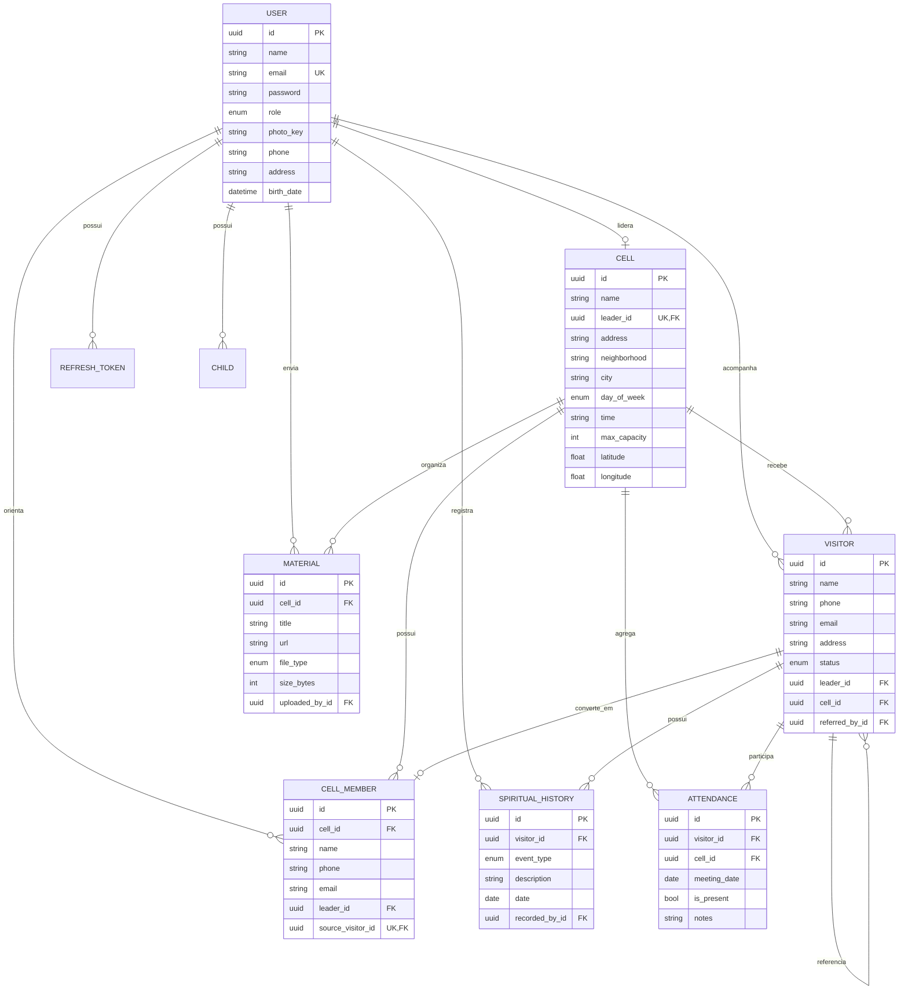

# 05. Diagrama DER

[⬅ Voltar ao indice do book](README.md)

```mermaid
erDiagram
    USER ||--o| CELL : lidera
    USER ||--o{ VISITOR : acompanha
    USER ||--o{ CELL_MEMBER : orienta
    USER ||--o{ MATERIAL : envia
    USER ||--o{ SPIRITUAL_HISTORY : registra
    USER ||--o{ REFRESH_TOKEN : possui
    USER ||--o{ CHILD : possui

    CELL ||--o{ VISITOR : recebe
    CELL ||--o{ CELL_MEMBER : possui
    CELL ||--o{ ATTENDANCE : agrega
    CELL ||--o{ MATERIAL : organiza

    VISITOR ||--o{ ATTENDANCE : participa
    VISITOR ||--o{ SPIRITUAL_HISTORY : possui
    VISITOR ||--o| CELL_MEMBER : converte_em
    VISITOR ||--o{ VISITOR : referencia

    USER {
      uuid id PK
      string name
      string email UK
      string password
      enum role
      string photo_key
      string phone
      string address
      datetime birth_date
    }

    CELL {
      uuid id PK
      string name
      uuid leader_id UK, FK
      string address
      string neighborhood
      string city
      enum day_of_week
      string time
      int max_capacity
      float latitude
      float longitude
    }

    VISITOR {
      uuid id PK
      string name
      string phone
      string email
      string address
      enum status
      uuid leader_id FK
      uuid cell_id FK
      uuid referred_by_id FK
    }

    CELL_MEMBER {
      uuid id PK
      uuid cell_id FK
      string name
      string phone
      string email
      uuid leader_id FK
      uuid source_visitor_id UK, FK
    }

    ATTENDANCE {
      uuid id PK
      uuid visitor_id FK
      uuid cell_id FK
      date meeting_date
      bool is_present
      string notes
    }

    SPIRITUAL_HISTORY {
      uuid id PK
      uuid visitor_id FK
      enum event_type
      string description
      date date
      uuid recorded_by_id FK
    }

    MATERIAL {
      uuid id PK
      uuid cell_id FK
      string title
      string url
      enum file_type
      int size_bytes
      uuid uploaded_by_id FK
    }
```

[⬅ Voltar ao indice do book](README.md)
