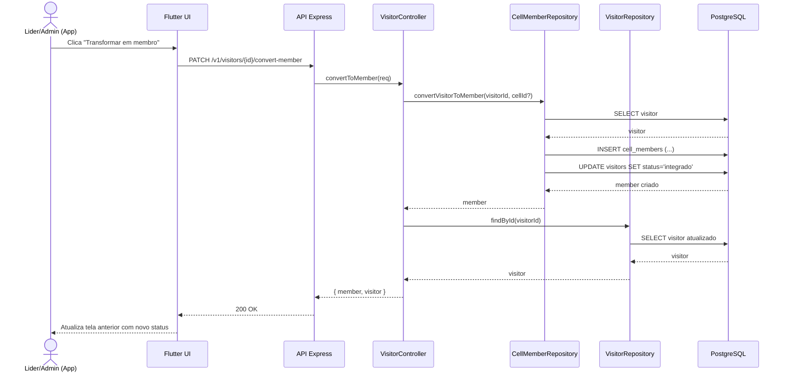
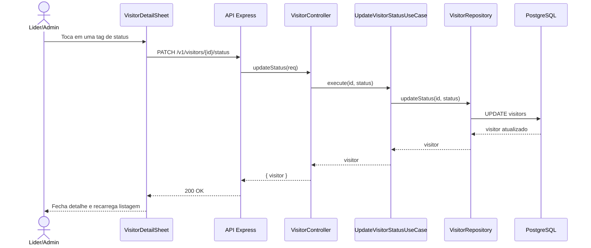

# 06. Diagrama de Sequencia

[⬅ Voltar ao indice do book](README.md)

## Conversao de visitante para membro de celula

## Atualizacao de status por tag no detalhe

[⬅ Voltar ao indice do book](README.md)
