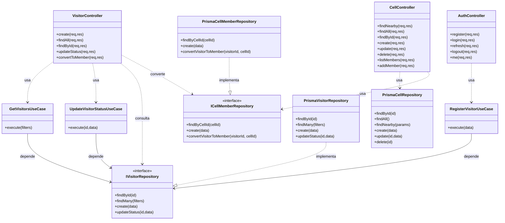

# 07. Diagrama de Classes

[⬅ Voltar ao indice do book](README.md)

```mermaid
classDiagram
    class AuthController {
      +register(req,res)
      +login(req,res)
      +refresh(req,res)
      +logout(req,res)
      +me(req,res)
    }

    class VisitorController {
      +create(req,res)
      +findAll(req,res)
      +findById(req,res)
      +updateStatus(req,res)
      +convertToMember(req,res)
    }

    class CellController {
      +findNearby(req,res)
      +findAll(req,res)
      +findById(req,res)
      +create(req,res)
      +update(req,res)
      +delete(req,res)
      +listMembers(req,res)
      +addMember(req,res)
    }

    class RegisterVisitorUseCase {
      +execute(data)
    }

    class GetVisitorsUseCase {
      +execute(filters)
    }

    class UpdateVisitorStatusUseCase {
      +execute(id,data)
    }

    class IVisitorRepository {
      <<interface>>
      +findById(id)
      +findMany(filters)
      +create(data)
      +updateStatus(id,data)
    }

    class ICellMemberRepository {
      <<interface>>
      +findByCellId(cellId)
      +create(data)
      +convertVisitorToMember(visitorId, cellId)
    }

    class PrismaVisitorRepository {
      +findById(id)
      +findMany(filters)
      +create(data)
      +updateStatus(id,data)
    }

    class PrismaCellMemberRepository {
      +findByCellId(cellId)
      +create(data)
      +convertVisitorToMember(visitorId, cellId)
    }

    class PrismaCellRepository {
      +findById(id)
      +findAll()
      +findNearby(params)
      +create(data)
      +update(id,data)
      +delete(id)
    }

    AuthController ..> RegisterVisitorUseCase : usa
    VisitorController ..> GetVisitorsUseCase : usa
    VisitorController ..> UpdateVisitorStatusUseCase : usa
    VisitorController ..> IVisitorRepository : consulta
    VisitorController ..> ICellMemberRepository : converte

    CellController ..> PrismaCellRepository : usa
    CellController ..> ICellMemberRepository : usa

    UpdateVisitorStatusUseCase --> IVisitorRepository : depende
    GetVisitorsUseCase --> IVisitorRepository : depende
    RegisterVisitorUseCase --> IVisitorRepository : depende

    PrismaVisitorRepository ..|> IVisitorRepository : implementa
    PrismaCellMemberRepository ..|> ICellMemberRepository : implementa
```

[⬅ Voltar ao indice do book](README.md)
