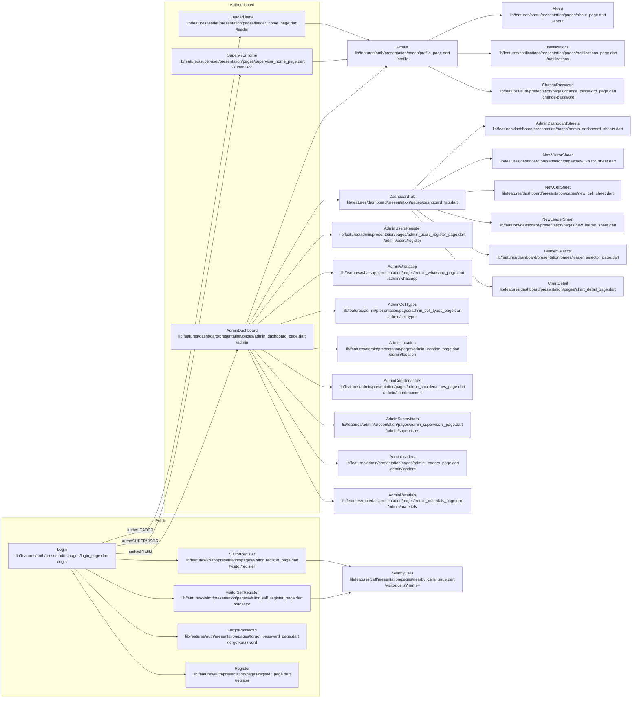

# Mapa de Telas — SistemaIgreja

Este documento lista as telas, rotas e responsabilidades principais. Inclui o diagrama Mermaid com os fluxos de navegação.

## Diagrama Mermaid

## Lista de telas

- `LoginPage` — **File**: [lib/features/auth/presentation/pages/login_page.dart](lib/features/auth/presentation/pages/login_page.dart), **Route**: `/login`, **Func**: autenticação; **Nav**: `Register`, `ForgotPassword`, `VisitorSelfRegister`; redireciona por role para `AdminDashboard`/`SupervisorHome`/`LeaderHome`.
- `RegisterPage` — **File**: [lib/features/auth/presentation/pages/register_page.dart](lib/features/auth/presentation/pages/register_page.dart), **Route**: `/register`, **Func**: cadastro de usuários (liderança); **Nav**: pós-cadastro vai para `LeaderHome`.
- `ForgotPasswordPage` — **File**: [lib/features/auth/presentation/pages/forgot_password_page.dart](lib/features/auth/presentation/pages/forgot_password_page.dart), **Route**: `/forgot-password`, **Func**: recuperação de senha; **Nav**: volta para `LoginPage`.
- `VisitorSelfRegisterPage` — **File**: [lib/features/visitor/presentation/pages/visitor_self_register_page.dart](lib/features/visitor/presentation/pages/visitor_self_register_page.dart), **Route**: `/cadastro`, **Func**: cadastro rápido para visitantes; **Nav**: pode abrir `NearbyCells`.
- `VisitorRegisterPage` — **File**: [lib/features/visitor/presentation/pages/visitor_register_page.dart](lib/features/visitor/presentation/pages/visitor_register_page.dart), **Route**: `/visitor/register`, **Func**: registro de visitante vinculado a célula; **Nav**: `NearbyCells`.
- `LeaderHomePage` — **File**: [lib/features/leader/presentation/pages/leader_home_page.dart](lib/features/leader/presentation/pages/leader_home_page.dart), **Route**: `/leader`, **Func**: visão do líder (resumo, ações de célula); **Nav**: `Profile`, sheets locais.
- `SupervisorHomePage` — **File**: [lib/features/supervisor/presentation/pages/supervisor_home_page.dart](lib/features/supervisor/presentation/pages/supervisor_home_page.dart), **Route**: `/supervisor`, **Func**: gestão de líderes e visão geral; **Nav**: detalhes de líderes, edição de células (sheets).
- `AdminDashboardPage` — **File**: [lib/features/dashboard/presentation/pages/admin_dashboard_page.dart](lib/features/dashboard/presentation/pages/admin_dashboard_page.dart), **Route**: `/admin`, **Func**: painel administrativo com abas; **Nav**: diversas áreas admin e `Profile`.
- `ProfilePage` — **File**: [lib/features/auth/presentation/pages/profile_page.dart](lib/features/auth/presentation/pages/profile_page.dart), **Route**: `/profile`, **Func**: editar perfil, avatar, filhos; **Nav**: `ChangePassword`, `Notifications`, `About`.
- `ChangePasswordPage` — **File**: [lib/features/auth/presentation/pages/change_password_page.dart](lib/features/auth/presentation/pages/change_password_page.dart), **Route**: `/change-password`, **Func**: alterar senha; **Nav**: volta para `Profile`.
- `NotificationsPage` — **File**: [lib/features/notifications/presentation/pages/notifications_page.dart](lib/features/notifications/presentation/pages/notifications_page.dart), **Route**: `/notifications`, **Func**: listar notificações; **Nav**: marcar como lidas.
- `AboutPage` — **File**: [lib/features/about/presentation/pages/about_page.dart](lib/features/about/presentation/pages/about_page.dart), **Route**: `/about`, **Func**: informações do app; **Nav**: acessível via `Profile`.
- `NearbyCellsPage` — **File**: [lib/features/cell/presentation/pages/nearby_cells_page.dart](lib/features/cell/presentation/pages/nearby_cells_page.dart), **Route**: `/visitor/cells?name=`, **Func**: listar células próximas (consulta por nome de visitante); **Nav**: vinculação para registro de visitante.
- `AdminMaterialsPage` — **File**: [lib/features/materials/presentation/pages/admin_materials_page.dart](lib/features/materials/presentation/pages/admin_materials_page.dart), **Route**: `/admin/materials`, **Func**: upload/gerenciamento de materiais; **Nav**: download/targets view.
- `AdminLeadersPage` — **File**: [lib/features/admin/presentation/pages/admin_leaders_page.dart](lib/features/admin/presentation/pages/admin_leaders_page.dart), **Route**: `/admin/leaders`, **Func**: CRUD de líderes; **Nav**: detalhe de líder (MaterialPageRoute).
- `AdminSupervisorsPage` — **File**: [lib/features/admin/presentation/pages/admin_supervisors_page.dart](lib/features/admin/presentation/pages/admin_supervisors_page.dart), **Route**: `/admin/supervisors`, **Func**: CRUD de supervisores; **Nav**: edição/listagem.
- `AdminCoordenacoesPage` — **File**: [lib/features/admin/presentation/pages/admin_coordenacoes_page.dart](lib/features/admin/presentation/pages/admin_coordenacoes_page.dart), **Route**: `/admin/coordenacoes`, **Func**: gerência de coordenações; **Nav**: CRUD.
- `AdminLocationPage` — **File**: [lib/features/admin/presentation/pages/admin_location_page.dart](lib/features/admin/presentation/pages/admin_location_page.dart), **Route**: `/admin/location`, **Func**: cidades/bairros; **Nav**: CRUD locais.
- `AdminCellTypesPage` — **File**: [lib/features/admin/presentation/pages/admin_cell_types_page.dart](lib/features/admin/presentation/pages/admin_cell_types_page.dart), **Route**: `/admin/cell-types`, **Func**: tipos de célula; **Nav**: CRUD.
- `AdminWhatsappPage` — **File**: [lib/features/whatsapp/presentation/pages/admin_whatsapp_page.dart](lib/features/whatsapp/presentation/pages/admin_whatsapp_page.dart), **Route**: `/admin/whatsapp`, **Func**: templates e envio via WhatsApp; **Nav**: template management.
- `AdminUsersRegisterPage` — **File**: [lib/features/admin/presentation/pages/admin_users_register_page.dart](lib/features/admin/presentation/pages/admin_users_register_page.dart), **Route**: `/admin/users/register`, **Func**: registrar usuários/admins; **Nav**: criação de contas.
- `DashboardTab` — **File**: [lib/features/dashboard/presentation/pages/dashboard_tab.dart](lib/features/dashboard/presentation/pages/dashboard_tab.dart), **Func**: abas do painel (estatísticas); **Nav**: `ChartDetail`, `LeaderSelector`.
- `ChartDetailPage` — **File**: [lib/features/dashboard/presentation/pages/chart_detail_page.dart](lib/features/dashboard/presentation/pages/chart_detail_page.dart), **Func**: detalhe de gráficos; **Nav**: aberto da aba do dashboard.
- `LeaderSelectorPage` — **File**: [lib/features/dashboard/presentation/pages/leader_selector_page.dart](lib/features/dashboard/presentation/pages/leader_selector_page.dart), **Func**: selecionar líder (vinculação rápida); **Nav**: usado em várias flows.
- `NewLeaderSheet` — **File**: [lib/features/dashboard/presentation/pages/new_leader_sheet.dart](lib/features/dashboard/presentation/pages/new_leader_sheet.dart), **Func**: sheet modal para criar líder.
- `NewCellSheet` — **File**: [lib/features/dashboard/presentation/pages/new_cell_sheet.dart](lib/features/dashboard/presentation/pages/new_cell_sheet.dart), **Func**: sheet modal para criar nova célula.
- `NewVisitorSheet` — **File**: [lib/features/dashboard/presentation/pages/new_visitor_sheet.dart](lib/features/dashboard/presentation/pages/new_visitor_sheet.dart), **Func**: sheet modal para adicionar visitante.
- `AdminDashboardSheets` — **File**: [lib/features/dashboard/presentation/pages/admin_dashboard_sheets.dart](lib/features/dashboard/presentation/pages/admin_dashboard_sheets.dart), **Func**: sheets exportadas usadas pelo dashboard.

## Observações e recomendações

- **Auth redirect**: O `GoRouter` usa `AuthBloc` para redirecionar após login para `/admin`, `/supervisor` ou `/leader` conforme o `role` do usuário. Roteamento público: `/login`, `/register`, `/forgot-password`, `/cadastro` estão liberados.
- **Agrupamento UI**: Sugiro usar uma **barra inferior** (bottom nav) para `LeaderHome`/`SupervisorHome` com acesso rápido a perfil e ações de célula; para `AdminDashboard` usar menu lateral ou abas principais para os módulos administrativos (`materials`, `leaders`, `supervisors`, `coordenacoes`, `location`, `cell-types`, `whatsapp`, `users/register`).
- **Próximos passos**: Quer que eu gere um gráfico PNG exportado do Mermaid ou abrir/editar o `docs/screen-map.md` com mais detalhes por tela? 

---
Gerado automaticamente em 2026-07-01.
